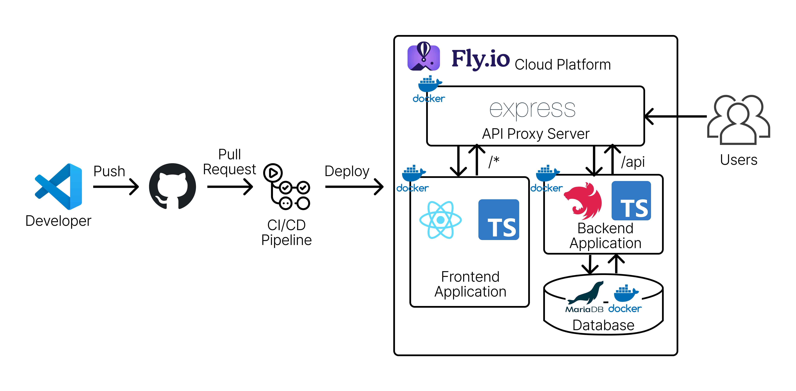

 

## 개요

> ⚡ 할 일을 더 이상 미루고 싶지 않다면? 나를 돕는 강력한 투두

🗓️ **2022.09. ~ 2026.06**

📖 **NOTION** https://www.notion.so/hjnoh/EXTREME-TODO-7c3557af91bf42f782de7c85102df4c0?pvs=4

🍺 **SERVICE LINK** https://extreme-frontend.fly.dev/

🐙 **BACKEND GITHUB** https://github.com/extreme-todo/backend

 

## 구성원

🧩 **Engineer** 안동규

🧩 **Engineer** 노희정

🦜 **Designer** 도경림

 

## 아키텍쳐

 

## 주요기능

### 1. 뽀모도로 루틴

- 개인에게 맞는 **집중 시간**과 **휴식 시간**을 설정하여 최적의 생산성 루틴을 만듭니다.
- *(참고: [포모도로 기법 - 위키백과](https://ko.wikipedia.org/wiki/포모도로_기법))*

### 2. 자유로운 카테고리

- 할 일(Todo)에 원하는 **카테고리를 자유롭게 부여**하고 직관적으로 분류할 수 있습니다.

### 3. 카테고리별 통계 및 기록

- **날짜별, 카테고리별**로 누적된 집중 시간을 기록하여 나의 집중 패턴을 한눈에 확인할 수 있습니다.

### 4. 익스트림 모드

- 느슨해진 정신에 긴장감을 불어넣는 강력한 패널티 모드입니다. **휴식 시간이 초과되면 모든 데이터가 초기화**됩니다.

 

## 학습/달성한 것

### 프론트엔드 및 설계 (Frontend Architecture)

#### 1. 동적 CSS-in-JS 스타일 테마

- `@emotion/styled` 를 활용한 테마 시스템 구축
- 상태의 변화(Extreme Mode)에 따라 UI가 동적이고 유동적으로 대응하는 `CSS-in-JS` 설계 능력을 확보

#### 2. Atomic Design Pattern

- UI 컴포넌트를 atom, molecule, organism 단위로 분할 설계함으로써, 
- 컴포넌트의 결합도를 낮추고 재사용성을 극대화
- 대규모 웹 프로젝트에서도 일관성 있고 유지보수가 용이한 프론트엔드 아키텍처 구조를 설계하는 역량을 학습

#### 3. Web Accessibility 및 표준 준수

- `aria-label` 을 이용한 시각적 마크업 보완과 `focus-trap-react` 를 통한 포커스 제어 구현
- 마우스가 없는 환경에서도 동일한 사용자 경험을 제공하는 웹 접근성(`a11y`) 표준과 키보드 내비게이션 설계 원칙을 지키려고 노력

#### 4. 상태 관리의 분리

- `@tanstack/react-query` 를 적용하여 비동기 네트워크 데이터를 서버 상태로 분리 관리
- 불필요한 클라이언트 상태 동기화 비용을 없애고 풍부한 데이터 캐싱 및 선언적 UI 렌더링 패턴을 달성

#### 5. 런타임 검증

- `zod` 를 이용한 런타임 데이터 검증 레이어를 도입함으로써, 프론트엔드의 비정상적인 데이터 흐름을 원천 차단

#### 6. 리버스 프록시 설계

- `Express` 와 `http-proxy-middleware` 를 활용한 리버스 프록시 환경 구축
- 웹 브라우저의 `CORS` 제한 우회 및 
크로스 도메인 쿠키 공유 이슈를 애플리케이션 프록시 서버 레벨에서 해결 
- 네트워크 통합 엔지니어링 역량을 학습

──────

### 데브옵스 및 테스트 (DevOps & Testing)

#### 1. CI/CD 파이프라인 구축

- `GitHub Actions` 기반의 지속적 통합/배포(CI/CD) 파이프라인을 구축 
- 개발 단계부터 배포에 이르기까지 휴먼 에러 최소화 
- 릴리즈 비용 절약

#### 2. 인프라 통합 관리

- `docker-compose` 를 이용한 멀티 컨테이너 통합 제어
- 개발팀 내 모든 구성원이 로컬 OS 환경에 구애받지 않고 원클릭으로 일관성 있는 앱/DB 개발 환경을 구동 및 세팅 가능
- 높은 이식성 확보

#### 3.  TDD(BDD) 체득

- `Jest` 의 브라우저 API 모킹 기법을 적용한 유닛 테스트 작성
- 설계의 허점을 조기에 발견
- Side-Effect로부터 핵심 비즈니스 로직의 신뢰성을 독립적으로 보장
- TDD(Test-Driven Develeopment) 방법론을 체득
- 테스트 작성 시에는 BDD(Behavior-Driven Development)를 적용하여 비즈니스 관점에서 사용자의 행동을 정의

 

## DOCUMENTS

[컨셉 정리](https://www.notion.so/4b935f7ada1e42919114cefaeed4c632?pvs=21)

[Extreme-Todo FrontEnd](https://www.notion.so/Extreme-Todo-FrontEnd-afb851d4da1f4028bc15e3576fbc4981?pvs=21)

[Extreme-Todo BackEnd](https://www.notion.so/Extreme-Todo-BackEnd-bcb153b90d53440ebc31c399c6748016?pvs=21)
