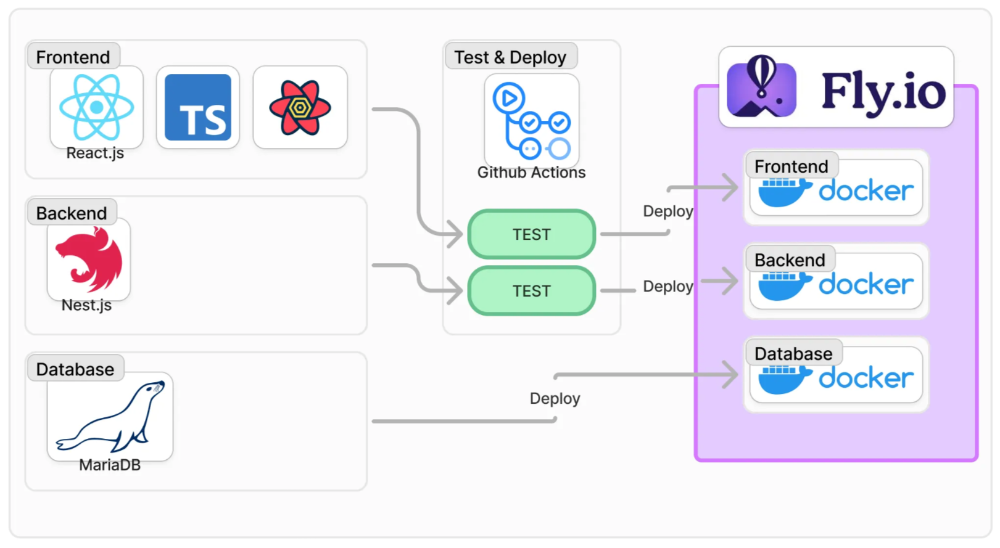
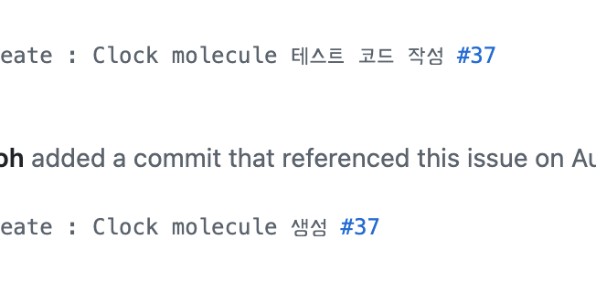

# EXTREME TODO

# —— **SUMMARY**

> ⚡ 할 일을 더 이상 미루고 싶지 않다면? 나를 돕는 강력한 투두

📖 **NOTION** https://www.notion.so/hjnoh/EXTREME-TODO-7c3557af91bf42f782de7c85102df4c0?pvs=4

🍺 **SERVICE LINK** https://extreme-frontend.fly.dev/

🐙 **GITHUB** https://github.com/extreme-todo

# —— TEAM

🧩 **FE, BE** 안동규, 노희정

🦜 **DESIGN** 도경림 (24.09~)

# —— PERIOD

🗓️ **2022.09. ~ NOW**

# —— ARCHITECTURE

# —— FEATURES

### **1. 익스트림 모드**

휴식 시간이 초과된 경우 모든 데이터를 초기화하는 강력한 패널티 부여합니다.

### **2. 뽀모도로**

집중 시간과 휴식 시간을 설정해 루틴을 만듭니다.

- https://ko.wikipedia.org/wiki/포모도로_기법

### **3. 투두 리스트**

Drag and Drop으로 손쉽게 할 일의 순서를 수정할 수 있습니다.

### **4. 카테고리**

투두에 카테고리를 자유롭게 부여할 수 있습니다.

### **5. 카테고리 별 랭킹**

카테고리 별 집중 시간을 랭킹으로 확인할 수 있습니다.

# —— DEVELOPMENT

### 1. TDD Test-Driven Development

비즈니스 로직보다 테스트 코드를 먼저 작성하는 개발 방식을 사용하여 설계 시의 결함을 가장 빨리 발견하고, 유지보수 시 테스트 비용을 절감합니다.

### 2. BDD Behavior-Driven Development

테스트 코드 작성 시 사용자의 행동에 초점을 맞춰 작성하여 누구나 이해하기 쉽도록 하였습니다.

### 3. Compound Components

컴포넌트 간의 결합도를 줄이고, IoC(Inversion Of Control) 의 관점에서도 우수한 디자인 패턴인 Compound Components 패턴을 도입하였습니다.

### 4. Atomic Design

UI와 비즈니스 로직을 분리하여 사이드 이펙트를 최소화하고, 컴포넌트의 재사용성을 높였습니다.

### 5. Functional Coding

DB에 접근하는 것 처럼 사이드 이펙트를 일으키는 메서드과 사이드 이펙트 없이 주어진 인자를 계산만 해주는 메서드를 나누어, 관심사 분리를 적용하고 테스트 비용을 절감했습니다.

# —— DOCUMENTS

[컨셉 정리](https://www.notion.so/4b935f7ada1e42919114cefaeed4c632?pvs=21)

[Extreme-Todo FrontEnd](https://www.notion.so/Extreme-Todo-FrontEnd-afb851d4da1f4028bc15e3576fbc4981?pvs=21)

[Extreme-Todo BackEnd](https://www.notion.so/Extreme-Todo-BackEnd-bcb153b90d53440ebc31c399c6748016?pvs=21)
